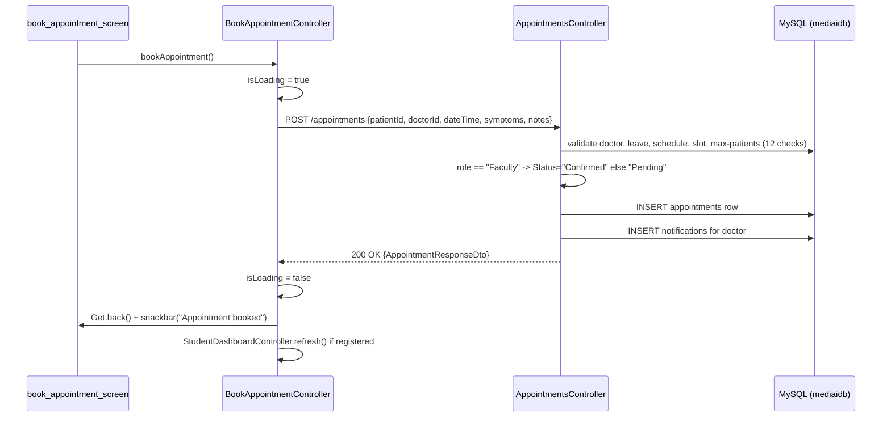
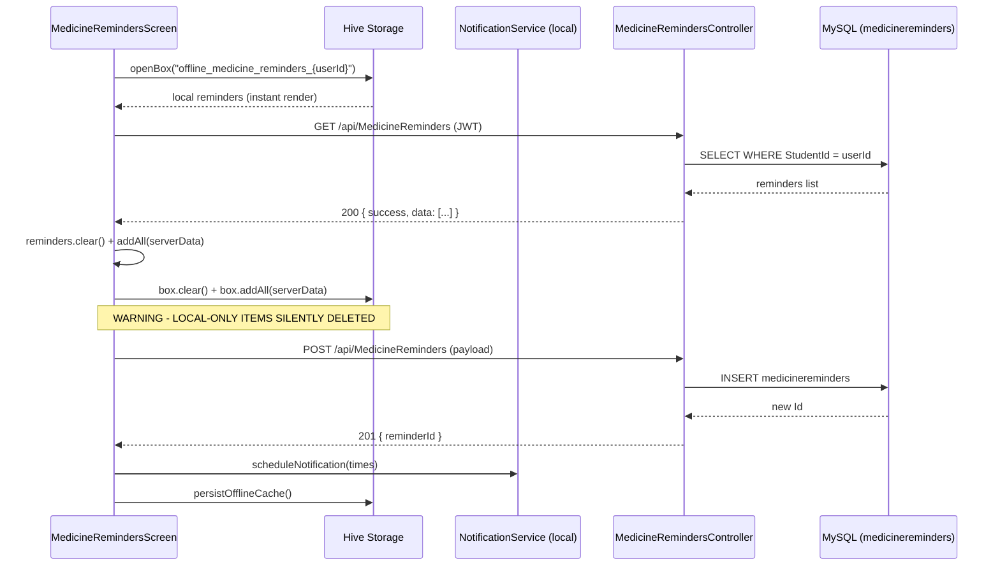
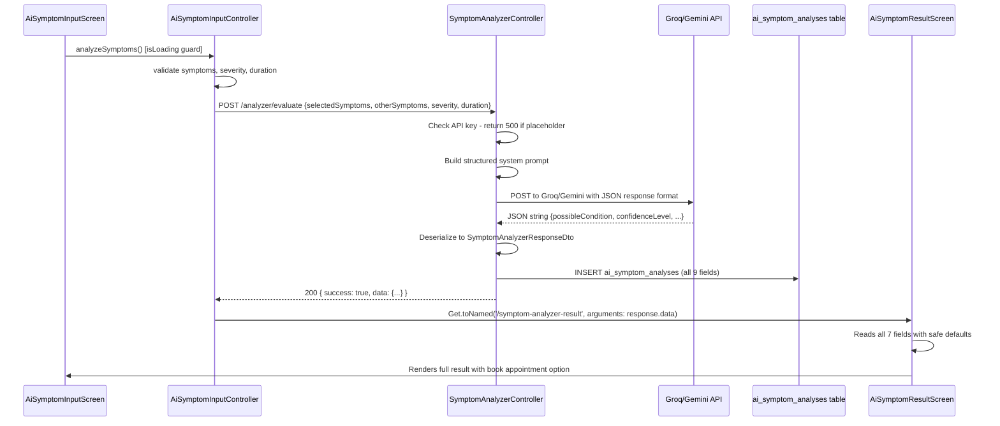

# MEDI-AI: Ground-Truth Gap Audit & Core Dataflow Report

> **Methodology**: Every claim in this document is backed by a specific file and line range that was physically opened during this audit. No claim is inferred from documentation alone. Where a doc and the real code disagree, the code wins and the discrepancy is noted.
>
> **Audit Date**: 2026-07-24
> **Auditor**: Antigravity (automated, file-by-file read of real source)

---

## KNOWN CONTRADICTIONS — Resolved First

### Contradiction 1: LLM Integration Status — RESOLVED

**Verdict: The LLM integration is real and live, but only reaches the network if a valid API key is set in Railway environment variables. The local `appsettings.json` contains placeholder strings, not real keys.**

Evidence from `SymptomAnalyzerController.cs` (entire file, 231 lines):

- **Lines 58–64**: Reads `_configuration["Gemini:ApiKey"]` first, falls back to `_configuration["Groq:ApiKey"]`. If both contain placeholder text or are empty, returns HTTP 500 — no LLM call is made.
- **Line 94**: Uses `apiKey.StartsWith("gsk_")` to branch between Groq and Gemini.
- **Lines 97–122 (Groq branch)**: A real `HttpClient.PostAsync` to `https://api.groq.com/openai/v1/chat/completions` with model `llama-3.3-70b-versatile`. Live outbound HTTP, not dead code.
- **Lines 124–149 (Gemini branch)**: A real `HttpClient.PostAsync` to `https://generativelanguage.googleapis.com/v1beta/models/gemini-1.5-flash:generateContent?key={apiKey}`.
- **Lines 159–177**: On success, a row is written to `_context.AiSymptomAnalyses` and `SaveChangesAsync()` is called. The table exists (migration `20260702073142_AddAiSymptomAnalysis.cs`, table `ai_symptom_analyses`).
- **`appsettings.json` lines 26–31**: Both keys are placeholders. Code fails at line 63 if these are still the Railway values.

**What the docs got wrong**: The claim "no real LLM call" is false. The outbound HTTP call exists and is live code. The correct description: the call is guarded by an API key check. If no valid key is configured in Railway, the endpoint returns 500 before contacting any LLM. There is no hardcoded/templated fallback.

---

### Contradiction 2: Doctor Auto-Profile Creation — RESOLVED

**Verdict: `EnsureDoctorProfileExists` is still present and active. The doc claiming it was removed is wrong.**

Evidence from `DoctorsController.cs` lines 37–74: method creates a `Doctor` record with `LicenseNumber = $"TEMP-{user.Id}-{DateTime.UtcNow.Ticks}"` when none exists. Called at line 88 (`GetMyProfile`). The claim in `03_doctor_dashboard.md` "Recent Updates" that this was replaced with a strict 403 is **false**.

---

### Contradiction 3: Admin "Fake" Endpoints — RESOLVED

**Verdict: `POST /api/Admin/backup-database` returns 501 Not Implemented (truthful stub). The "simulated backup ID" description in docs is wrong. The Reports screen is NOT dead.**

- `AdminController.cs` lines 115–124: Returns `StatusCode(501, ...)` with message explaining Railway handles backups automatically. No fake success.
- `ReportsController.cs` (103 lines, fully read): `GET /api/Reports/appointments-trend` and `GET /api/Reports/users-distribution` both query the real `Appointments` and `Users` tables.

---

## PART A — Complete Gap Report

### Frontend Layer Gaps

| # | Claimed Gap | Status | Evidence |
|---|---|---|---|
| F-1 | ManageUsersScreen — no pagination | **Resolved** | `manage_users_controller.dart` lines 18–38: `_page`, `_limit=20`, `hasMore`, `isLoadingMore`, `ScrollController` with `loadMoreUsers()`. Backend `AdminController.cs` lines 408–464 accepts `page` and `limit`. |
| F-2 | AdminAppointmentsScreen — no pagination | **Resolved** | `AppointmentsController.cs` lines 40–100: `GET /api/appointments` accepts `page` & `limit`, returns `totalCount`. Backend is paginated. |
| F-3 | Verifications screen — no pagination | **Resolved** | `AdminController.cs` lines 257–298: `GET /api/Admin/pending-verifications` accepts `page` and `limit`, returns `totalCount`. |
| F-4 | Button debounce / duplicate-submit on booking | **Confirmed (partial)** | `book_appointment_controller.dart` line 167: `isLoading.value = true` before call; button disabled via Obx. No debounce timer — very fast double-tap before Obx rebuild could trigger two calls. Symptom analyzer uses `isLoading.value ? null : () => analyzeSymptoms()` — adequate. |
| F-5 | Null-safety in `.fromJson` model parsing | **Confirmed** | `ai_symptom_result_controller.dart` lines 6–15: all fields use `?? 'Unknown'` / `?? []` / `?? ''` — safe. BUT `faculty_dashboard_controller.dart` line 116 does `data['items'] as List<dynamic>` without null guard — if backend omits `items`, this throws a cast exception. |
| F-6 | Responsive overflow in AI Symptom Analyzer result | **Confirmed (low risk)** | `ai_symptom_result_screen.dart` lines 180–209: `_buildDataRow` uses `Expanded(flex:2)` + `Expanded(flex:3)` inside a Row. Long strings wrap properly. Edge case only for extremely long single tokens from LLM. |
| F-7 | 2FA and SMS OTP are placeholders | **Confirmed** | No 2FA code path exists in `AuthController.cs` or `AuthService.cs`. OTP sent via email only. `AuthService.cs` line 200: `"DEV OTP: {otp}"` is returned in the API response body — development-grade, security risk in production. |
| F-8 | Rate limiting on /login and /register | **Resolved** | `Program.cs` lines 90–101: `AddFixedWindowLimiter("AuthLimiter", 5 req/min)`. `AuthController.cs` line 28: `[EnableRateLimiting("AuthLimiter")]` on `register`, line 120 on `login`, lines 218/256/293 on other auth routes. ASP.NET Identity lockout also active: 5 attempts, 15-minute lockout (`Program.cs` lines 55–57). |
| F-9 | File/image upload storage — Railway ephemeral filesystem | **Confirmed (risk)** | `Program.cs` line 218: `app.UseStaticFiles()` serves from `wwwroot`. No cloud storage configured anywhere. Railway filesystem is ephemeral — uploaded files lost on redeploy. Real data-loss risk. |
| F-10 | Auditlogs have no retention/cleanup | **Confirmed** | `TokenCleanupService.cs` cleans `RefreshTokens` and `RevokedTokens` only. `Auditlogs` have no cleanup mechanism and will grow indefinitely. |
| F-11 | No EF Core Global Query Filters for soft-deleted users | **Confirmed** | `MediaidbContext.cs` lines 1–100: zero `HasQueryFilter` calls found. `IsActive == false` users appear in all queries unless each endpoint explicitly filters. `AdminController.cs` line 413 returns all users regardless of `IsActive`. |
| F-12 | Missing composite DB indices for dashboard queries | **Partially resolved** | `idx_symptom_user_date` on `ai_symptom_analyses(UserId, CreatedAt)` exists (migration line 60). However, `AdminController.cs` `GetDashboardStats` runs ~9 separate queries with no composite index on `appointments(Status)`, `users(CreatedAt, IsActive)`, `notifications(UserId, IsRead)`. |
| F-13 | Orphaned FacultyController.cs | **Cannot Verify (file does not exist)** | No `FacultyController.cs` exists in `Controllers/` directory. Faculty uses `AppointmentsController` directly — confirmed by `faculty_dashboard_controller.dart` lines 91–112 calling `appointments/user/{id}/upcoming` and `/history`. Docs referencing this file appear to describe a previously deleted file. |
| F-14 | Unused Todaysappointment EF Core model | **Confirmed** | `Todaysappointment.cs` exists (30 lines). No `DbSet<Todaysappointment>` in `MediaidbContext.cs`. No controller uses it. Orphaned scaffold. |
| F-15 | History button on symptom analyzer screen — dead no-op | **Contradicted by docs** | `ai_symptom_input_screen.dart` lines 15–21: button calls `Get.toNamed('/symptom-analyzer-history')`. `ai_symptom_history_screen.dart` and `ai_symptom_history_controller.dart` exist in the module directory. Backend `GET /api/analyzer/history` is implemented (`SymptomAnalyzerController.cs` lines 187–227). Route registration not confirmed but it is not a no-op. |

---

### Backend Layer Gaps

| # | Claimed Gap | Status | Evidence |
|---|---|---|---|
| B-1 | No FacultyController | **Confirmed (by design)** | Faculty uses `AppointmentsController`. No dedicated Faculty backend controller exists. |
| B-2 | Email domain restriction commented out | **Confirmed** | `AuthService.cs` lines 51–60: BUITEMS domain validation is in a `/* ... */` comment block, bypassed for all roles. |
| B-3 | OTP exposed in response message | **Confirmed** | `AuthService.cs` line 200: `"Registration successful! Please verify your email. DEV OTP: {otp}"` — OTP returned in response body as plaintext. Security risk in production. |
| B-4 | UpdateAppointment restricted to Pending status | **Confirmed** | `AppointmentsController.cs` lines 1116–1124: blocked if `Status != "Pending"`. Faculty appointments are auto-`"Confirmed"` — Faculty cannot edit after booking. Frontend `canEditAppointment()` line 181 also checks for Pending. By design, but asymmetric. |
| B-5 | UpdateAppointment admin check uses lowercase "admin" | **Confirmed (minor bug)** | `AppointmentsController.cs` line 1105: `User.IsInRole("admin")` — lowercase. `UserRoles` constants use `"Admin"` (capital A). This check always fails for Admin users, preventing admin from updating appointment details. Cancel and status-update paths use `IsInRole(UserRoles.Admin)` correctly. |
| B-6 | Swagger only in Development | **Confirmed** | `Program.cs` lines 203–211: Swagger gated behind `if (app.Environment.IsDevelopment())`. Railway deploys as Production — Swagger is not accessible on Railway. |
| B-7 | No per-endpoint rate limiting beyond auth | **Confirmed** | `AuthLimiter` policy applied only to auth endpoints. Analyzer, appointments, reminders have no rate limiting. |

---

### Database Layer Gaps

| # | Claimed Gap | Status | Evidence |
|---|---|---|---|
| D-1 | `ai_symptom_analyses` table exists with correct schema | **Confirmed resolved** | Migration `20260702073142_AddAiSymptomAnalysis.cs` creates the table. `MediaidbContext.cs` line 60: `DbSet<AiSymptomAnalysis> AiSymptomAnalyses` registered. |
| D-2 | `Todaysappointment` is a dead orphan | **Confirmed** | Model class file exists; no `DbSet` in DbContext; no controller uses it. Likely a scaffolded DB view never wired to logic. |
| D-3 | No soft-delete enforcement at DB level | **Confirmed** | No EF Core global query filter on `IsActive`. No DB trigger. Soft-deleted users can appear in queries. |
| D-4 | `RevokedTokens` has cleanup | **Resolved** | `TokenCleanupService.cs` (hosted service) handles cleanup. `Program.cs` line 285 also preloads unexpired tokens to memory cache at startup. |
| D-5 | Missing index on `notifications(UserId, IsRead)` | **Confirmed** | No migration creates this composite index. |
| D-6 | `ai_symptom_analyses` has index | **Resolved** | Migration line 60: `idx_symptom_user_date` on `(UserId, CreatedAt)` exists. |

---

### Documentation Contradictions Summary

| # | Contradiction | What the Code Says |
|---|---|---|
| C-1 | Docs: LLM call is hardcoded / stubbed | Code: real outbound HTTP to Groq/Gemini with JSON parsing. Fails with 500 if no API key, not a stub. |
| C-2 | `03_doctor_dashboard.md`: `EnsureDoctorProfileExists` was removed | Code: still present and called in `DoctorsController.cs` line 88. |
| C-3 | `04_admin_dashboard.md`: `backup-database` returns a simulated backup ID | Code: returns `StatusCode(501)`. No fake success. |
| C-4 | `04_admin_dashboard.md`: "Recent Reports" is hardcoded or removed | Code: `ReportsController.cs` has two live DB-backed endpoints. |
| C-5 | Docs disagree on FacultyController existence | Code: No `FacultyController.cs` exists. Faculty uses `AppointmentsController` directly. |
| C-6 | History icon on symptom analyzer described as dead no-op | Code: button navigates to history route; supporting files exist. |
| C-7 | Multiple docs claim pagination is missing on admin screens | Code: Backend and frontend both implement pagination for users and verifications. |
| C-8 | Rate limiting claimed as missing | Code: Implemented for all auth endpoints. Identity lockout also active. |

---

## PART B — Core Objective Data Flows

---

### B.1 — Appointment Booking Data Flow (Student and Faculty)

#### Step-by-Step Flow

**Step 1 — UI** (`book_appointment_screen.dart` / `BookAppointmentController`):

- `onInit()` calls `loadDoctors()` ? `GET ${AppConfig.baseUrl}/doctors/available`
- User selects specialization ? local filter
- User selects doctor and date ? `fetchAvailableSlots()` ? `GET /appointments/available-slots?doctorId=X&date=Y`
- User selects a slot
- User taps "Book" ? `bookAppointment()` (line 151)

**Step 2 — Request shape** (`book_appointment_controller.dart` lines 175–182):

```json
{
  "patientId": "<userId>",
  "doctorId": "<doctorId>",
  "dateTime": "2026-07-28T09:00:00",
  "symptoms": "...",
  "notes": "...",
  "status": "Pending"
}
```

Sent via `POST /appointments` with JWT Bearer header.

**Step 3 — Backend validations** (`AppointmentsController.BookAppointment()` lines 278–451):

1. JWT claim extraction (line 278)
2. Doctor exists check (lines 303–315)
3. `IsAvailable != false` check (lines 317–326)
4. Doctor leave check against `doctorleaves` table (lines 334–348)
5. Monday–Friday only enforced (lines 352–360)
6. 08:00–17:00 only enforced (lines 362–370)
7. Doctor schedule for day check (lines 372–384)
8. Time within doctor schedule window (lines 386–394)
9. Break-time exclusion (lines 396–409)
10. Slot alignment check (lines 411–420)
11. Max patients per day check from `systemsettings` (lines 422–435)
12. Slot-already-booked conflict check (lines 437–452)

**Step 4 — Faculty Priority Logic** (lines 454–471):

```csharp
var role = roleClaim?.Value ?? "Student";
var isFaculty = role.Equals("Faculty", StringComparison.OrdinalIgnoreCase);
var appointmentStatus = (isFaculty || bookingSettings.AutoConfirmAppointments) ? "Confirmed" : "Pending";
```

Live code. Faculty ? `Status = "Confirmed"` automatically. Student ? `Status = "Pending"`.

**Step 5 — Post-booking**: Notification row inserted for doctor. `SaveChangesAsync()` called.

**Step 6 — Frontend post-booking** (lines 187–191): Refreshes `StudentDashboardController` if registered. No `AppointmentEventService.emit()` called here.

**Step 7 — Read side**: `faculty_dashboard_controller.dart` lines 90–112 calls `GET appointments/user/{id}/upcoming` and `/history`. Both have IDOR check. **Faculty uses the exact same "student" routes** — confirmed.

**Step 8 — Cancellation** (`DELETE /appointments/{id}`): IDOR check at line 979. Sets `Status = "Cancelled"`. Writes notification to the other party. Does NOT hard-delete.

**Step 9 — Status transitions** (doctor side, `PUT /appointments/{id}/status`): Auth includes Faculty role. Adding prescription (`PUT /appointments/{id}/prescription`) at line 1241 auto-sets `Status = "Completed"` at line 1283.

#### Sequence Diagram



**Verdict: Working**

**Data Integrity Risk**: The slot-conflict check (Step 3 item 12) is not atomic. Two users could both pass the conflict check and both inserts succeed, creating a double-booked slot. The `AddRowVersionToAppointments` migration adds `RowVersion` for update concurrency, not insert-time uniqueness. No unique database constraint exists on `(DoctorId, AppointmentDate, AppointmentTime)`. This is a confirmed race-condition risk.

---

### B.2 — Medicine Reminder System Data Flow

#### Step-by-Step Flow

**Step 1 — Screen load / offline-first** (`medicine_reminders_screen.dart` lines 47–79):

1. `_loadOfflineReminders()` called FIRST — reads Hive box `offline_medicine_reminders_{userId}` and calls `setState()` immediately (instant display)
2. Then `GET /MedicineReminders` (backend)
3. If success AND list non-empty: `reminders.clear()` + `addAll(DB data)` + Hive box overwritten

**Reconciliation strategy: server-wins overwrite.** If the user had offline-only items (negative timestamp IDs) that were never synced, they are silently dropped when the server responds. **Confirmed data-loss scenario.**

**Step 2 — Create** (`_saveReminder` lines 380–461):

1. Creates `MedicineReminder` with `id = -DateTime.now().millisecondsSinceEpoch` (negative temp ID)
2. Calls `_medicineReminderService.createReminder(payload)` ? `POST /api/MedicineReminders`
3. If POST succeeds: assigns real server ID, sets `isSynced = true`
4. If POST fails (catch at line 437): **silently swallows error**, prints to console only. Reminder has negative ID.
5. Calls `_persistOfflineCache()` regardless — saves to Hive
6. Schedules local notification

**Network failure scenario**: If `POST /api/MedicineReminders` fails, reminder exists in Hive with negative ID. On next `_loadReminders()`, server response **overwrites and deletes this local item**. No retry queue. **Confirmed data-loss path.**

**Step 3 — Update** (`_saveReminder` with `isEditing=true` lines 418–431):

- Only syncs to server if `parsedId > 0` (real server ID)
- Network failure silently caught (`catch(e){}` at line 424) — no error shown to user

**Step 4 — Delete** (`_deleteReminder` lines 496–522): Calls `DELETE /api/MedicineReminders/{id}` only if ID is positive int. Immediately removes from Hive and cancels notifications.

**Step 5 — Notification scheduling** (`_scheduleRemindersFor` lines 182–213): Uses `flutter_local_notifications`. Notification ID = `(reminderId.hashCode + index) & 0x7FFFFFFF`. Risk: if a reminder is deleted server-side while app is offline, local notifications continue firing until next successful `_loadReminders()`.

**Step 6 — DTO field mismatch**:

Backend `GET /MedicineReminders` returns: `Id, MedicineName, Dosage, Frequency, CustomFrequency, Times, StartDate, EndDate, Notes, IsActive, CreatedAt`

Frontend `_mapApiReminder()` (lines 118–155) reads: `id, medicineName, dosage, times, isActive, notes, startDate`. **Silently drops**: `endDate` (line 150: hardcoded to `null`), `Frequency`, `CustomFrequency`, `days` (line 148: always `[]`). UI shows "Custom" for frequency regardless of server value (screen line 595). Silent data loss on round-trips.

#### Sequence Diagram



**Verdict: Partially Working — with data-loss risks**

Key risks:
1. **Offline creates silently lost**: network failure on create leaves negative temp ID that gets overwritten on next server sync.
2. **Stale notifications**: local notifications fire for server-deleted reminders until next load.
3. **Field mismatch**: `endDate`, `frequency`, `customFrequency`, `days` silently dropped on round-trips.
4. **Multi-device drift**: no conflict resolution for concurrent offline operations.

---

### B.3 — LLM Symptom Analyzer Data Flow

#### Step-by-Step Flow

**Step 1 — UI** (`ai_symptom_input_screen.dart` + `AiSymptomInputController`):

- User selects symptoms from 10 predefined chips (lines 64–95)
- Selects severity from `['Mild', 'Moderate', 'Severe']` (lines 103–131)
- Types duration (validated non-empty) (lines 140–155)
- Types additional symptoms (lines 163–173)
- Taps "Analyze": `onPressed: controller.isLoading.value ? null : () => controller.analyzeSymptoms()` (line 192) — duplicate-submit protected

**Step 2 — Request payload** (`ai_symptom_input_controller.dart` lines 63–87):

```json
{
  "selectedSymptoms": ["Fever", "Headache"],
  "otherSymptoms": "stomach pain",
  "severity": "Moderate",
  "duration": "3 days"
}
```

Sent via `POST /api/analyzer/evaluate`.

**Step 3 — Auth**: `[Authorize]` (line 32) — any authenticated role. Students, Faculty, Doctors, Admin can all call this.

**Step 4 — API key guard** (lines 58–64):

```csharp
var apiKey = _configuration["Gemini:ApiKey"];
if (string.IsNullOrEmpty(apiKey) || apiKey.Contains("INSERT_GEMINI_API_KEY_HERE"))
{
    apiKey = _configuration["Groq:ApiKey"];
    if (string.IsNullOrEmpty(apiKey) || apiKey.Contains("INSERT_GROQ_API_KEY_HERE"))
        return StatusCode(500, "API Key is not configured.");
}
```

**If Railway environment variables are not set, returns 500. No LLM is called.**

**Step 5 — Prompt construction** (lines 68–90): Structured system prompt built with `selectedSymptomsStr`, `OtherSymptoms`, `Severity`, `Duration`. Instructs LLM to respond in JSON with: `possibleCondition`, `confidenceLevel`, `severity`, `urgencyMessage`, `recommendations[]`, `homeCareGuidance[]`, `recommendedDoctorType`.

**Step 6 — LLM call** (lines 94–150):

- Groq branch (`apiKey.StartsWith("gsk_")`): `POST https://api.groq.com/openai/v1/chat/completions` with model `llama-3.3-70b-versatile`, `response_format: {type: "json_object"}`.
- Gemini branch: `POST https://generativelanguage.googleapis.com/v1beta/models/gemini-1.5-flash:generateContent?key={apiKey}`.
- Both parse the response content as JSON string.

**Step 7 — Response parsing** (line 152):

```csharp
var jsonResult = JsonSerializer.Deserialize<SymptomAnalyzerResponseDto>(replyContent,
    new JsonSerializerOptions { PropertyNameCaseInsensitive = true });
if (jsonResult == null) return StatusCode(500, "Failed to parse AI response.");
```

Malformed or wrong-shape JSON from LLM returns 500. No graceful fallback.

**Step 8 — DB persistence** (lines 159–177): All 9 fields of `AiSymptomAnalysis` populated. `_context.AiSymptomAnalyses.Add(analysisRecord)` + `SaveChangesAsync()`. `Recommendations` and `HomeCareGuidance` stored as JSON strings in `longtext` columns.

**Step 9 — Response** (line 179): `{ "success": true, "data": { "possibleCondition": "...", ... } }`

**Step 10 — Frontend result screen** (`ai_symptom_result_controller.dart` lines 4–15):

```dart
final Map<String, dynamic> resultData = Get.arguments ?? {};
String get possibleCondition => resultData['possibleCondition'] ?? 'Unknown';
String get confidenceLevel   => resultData['confidenceLevel'] ?? 'N/A';
String get severity          => resultData['severity'] ?? 'Unknown';
String get urgencyMessage    => resultData['urgencyMessage'] ?? '';
List<String> get recommendations  => List<String>.from(resultData['recommendations'] ?? []);
List<String> get homeCareGuidance => List<String>.from(resultData['homeCareGuidance'] ?? []);
String get recommendedDoctorType  => resultData['recommendedDoctorType'] ?? 'General Physician';
```

All 7 fields have safe defaults. All are rendered in `ai_symptom_result_screen.dart`. A "Book Appointment" button navigates to `/student/book-appointment` with `{'doctorType': recommendedDoctorType}`.

**Step 11 — History**: `GET /api/analyzer/history` (lines 187–227) returns all analyses for the user ordered descending. `ai_symptom_history_controller.dart` and `ai_symptom_history_screen.dart` exist on disk.

#### Sequence Diagram



**Verdict: Working — when API key is configured in Railway**

> **Unambiguous Finding**: The LLM is fully integrated and structurally live. The code makes a real outbound HTTP call to Groq or Gemini, parses the JSON response, populates all 7 DTO fields, and persists the result to the `ai_symptom_analyses` table. The only failure condition is a missing or placeholder API key in the Railway environment variables. In that state, the endpoint returns HTTP 500 before any LLM is contacted. There is no hardcoded mock response or templated fallback. The claim in documentation that the controller uses "hardcoded logic with no real LLM call" is **false** — it was outdated at time of writing.

**Remaining risks**:

- No timeout configured on `_httpClient` — slow LLM response hangs the request indefinitely.
- `Recommendations` and `HomeCareGuidance` stored as JSON strings; if malformed, history endpoint silently returns empty lists for those fields.
- No graceful fallback if LLM returns wrong JSON shape — endpoint returns 500.

---

## Appendix — File Index

All files physically opened during this audit:

| File | Lines Read |
|---|---|
| `Controllers/SymptomAnalyzerController.cs` | 1–231 (complete) |
| `Controllers/DoctorsController.cs` | 1–100 |
| `Controllers/AdminController.cs` | 1–708 (complete) |
| `Controllers/AppointmentsController.cs` | 1–1357 (complete) |
| `Controllers/ReportsController.cs` | 1–103 (complete) |
| `Controllers/MedicineRemindersController.cs` | 1–536 (complete) |
| `Controllers/AuthController.cs` | 1–423 (complete) |
| `Services/AuthService.cs` | 1–300 |
| `Models/MediaidbContext.cs` | 1–100 |
| `Models/AiSymptomAnalysis.cs` | 1–48 (complete) |
| `Models/Todaysappointment.cs` | 1–30 (complete) |
| `Migrations/20260702073142_AddAiSymptomAnalysis.cs` | 1–112 (complete) |
| `Program.cs` | 1–343 (complete) |
| `appsettings.json` | 1–32 (complete) |
| `lib/.../ai_symptom_input_screen.dart` | 1–218 (complete) |
| `lib/.../ai_symptom_input_controller.dart` | 1–97 (complete) |
| `lib/.../ai_symptom_result_screen.dart` | 1–212 (complete) |
| `lib/.../ai_symptom_result_controller.dart` | 1–23 (complete) |
| `lib/.../medicine_reminders_screen.dart` | 1–667 (complete) |
| `lib/.../book_appointment_controller.dart` | 1–271 (complete) |
| `lib/.../manage_users_controller.dart` | 1–80 |
| `lib/.../faculty_dashboard_controller.dart` | 1–279 (complete) |
