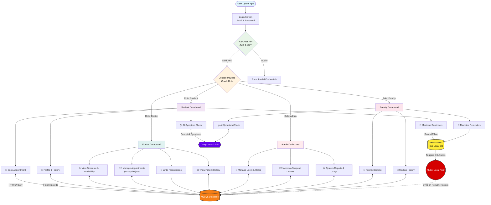

```mermaid
flowchart TB
    %% Authentication Phase
    Start(["User Opens App"]) --> Login["Login Screen<br>Email & Password"]
    Login --> Verify{"ASP.NET API<br>Auth & JWT"}
    Verify -- Valid JWT --> Decode{"Decode Payload<br>Check Role"}
    Verify -- Invalid --> LoginError["Error: Invalid Credentials"]
    
    %% Role Based Dashboards
    Decode -- Role: Student --> StudentDashboard["Student Dashboard"]
    Decode -- Role: Doctor --> DoctorDashboard["Doctor Dashboard"]
    Decode -- Role: Admin --> AdminDashboard["Admin Dashboard"]
    Decode -- Role: Faculty --> FacultyDashboard["Faculty Dashboard"]
    
    %% Student Features & Flow
    StudentDashboard --> S_Appt["📅 Book Appointment"]
    StudentDashboard --> S_Rem["💊 Medicine Reminders"]
    StudentDashboard --> S_AI["🩺 AI Symptom Check"]
    StudentDashboard --> S_Prof["👤 Profile & History"]
    
    S_Appt <-->|HTTPS/REST| MySQL[(MySQL Database)]
    S_Rem -->|Saves Offline| Hive[(Hive Local DB)]
    Hive -->|Triggers OS Alarms| Notif((Flutter Local Notif))
    S_AI <-->|Prompt & Symptoms| GroqCloud{{Groq Llama 3 API}}
    S_Prof <-->|Fetch Records| MySQL
    
    %% Doctor Features & Flow
    DoctorDashboard --> D_Sched["🗓️ View Schedule & Availability"]
    DoctorDashboard --> D_Appt["👨‍⚕️ Manage Appointments<br>(Accept/Reject)"]
    DoctorDashboard --> D_Presc["📝 Write Prescriptions"]
    DoctorDashboard --> D_Hist["📋 View Patient History"]
    
    D_Sched <--> MySQL
    D_Appt <--> MySQL
    D_Presc --> MySQL
    D_Hist <--> MySQL
    
    %% Admin Features & Flow
    AdminDashboard --> A_Users["👥 Manage Users & Roles"]
    AdminDashboard --> A_Doctors["👨‍⚕️ Approve/Suspend Doctors"]
    AdminDashboard --> A_Metrics["📊 System Reports & Usage"]
    
    A_Users <--> MySQL
    A_Doctors <--> MySQL
    A_Metrics <--> MySQL
    
    %% Faculty Features & Flow
    FacultyDashboard --> F_Appt["📅 Priority Booking"]
    FacultyDashboard --> F_Rem["💊 Medicine Reminders"]
    FacultyDashboard --> F_AI["🩺 AI Symptom Check"]
    FacultyDashboard --> F_Prof["👤 Medical History"]
    
    F_Appt <--> MySQL
    F_Rem --> Hive
    F_AI <--> GroqCloud
    F_Prof <--> MySQL

    %% Synchronization Flow (Offline to Online)
    Notif -.->|Sync on Network Restore| MySQL

    %% Styling for clarity
    style Start fill:#e1f5fe,color:#000000
    style Verify fill:#e8f5e8,color:#000000
    style Decode fill:#fff3e0,color:#000000
    style StudentDashboard fill:#f3e5f5,color:#000000
    style DoctorDashboard fill:#e0f2f1,color:#000000
    style AdminDashboard fill:#ffebee,color:#000000
    style FacultyDashboard fill:#fce4ec,color:#000000
    
    style MySQL fill:#f57f17,color:#ffffff,stroke:#333,stroke-width:2px
    style GroqCloud fill:#6200ea,color:#ffffff,stroke:#333,stroke-width:2px
    style Hive fill:#ffeb3b,color:#000000,stroke:#333,stroke-width:2px
    style Notif fill:#d50000,color:#ffffff,stroke:#333,stroke-width:2px
```
