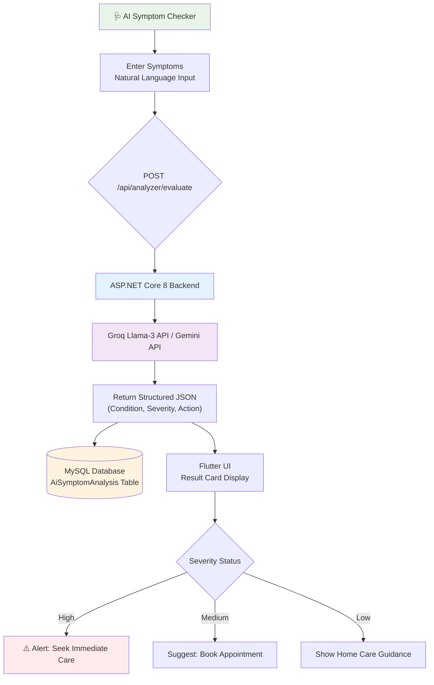

```mermaid
flowchart TB
    Feature1["🩺 AI Symptom Checker"] --> SymptomInput["Enter Symptoms<br>Natural Language Input"]
    SymptomInput --> API_Call{"POST /api/analyzer/evaluate"}
    API_Call --> ASP_NET["ASP.NET Core 8 Backend"]
    ASP_NET --> GroqAPI["Groq Llama-3 API / Gemini API"]
    GroqAPI --> JSONResponse["Return Structured JSON<br>(Condition, Severity, Action)"]
    JSONResponse --> MySQL[("MySQL Database<br>AiSymptomAnalysis Table")]
    JSONResponse --> DisplayResult["Flutter UI<br>Result Card Display"]
    DisplayResult --> ActionDecision{"Severity Status"}
    ActionDecision -- High --> Emergency["⚠️ Alert: Seek Immediate Care"]
    ActionDecision -- Medium --> DoctorRecommend["Suggest: Book Appointment"]
    ActionDecision -- Low --> SelfCare["Show Home Care Guidance"]
    
    style Feature1 fill:#e8f5e8
    style ASP_NET fill:#e3f2fd
    style GroqAPI fill:#f3e5f5
    style MySQL fill:#fff3e0
    style Emergency fill:#ffebee
```
