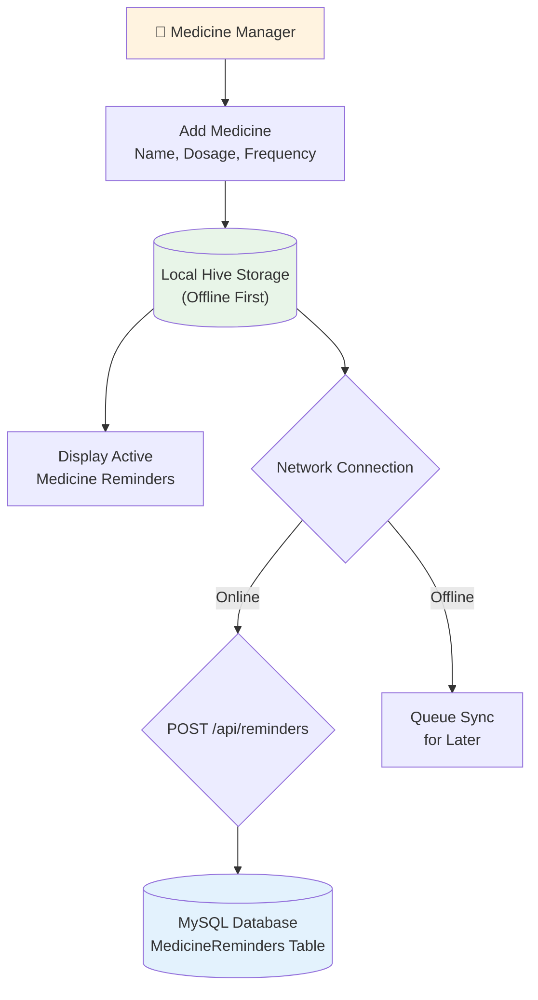

```mermaid
flowchart TB
    Feature2["💊 Medicine Manager"] --> MedInput["Add Medicine<br>Name, Dosage, Frequency"]
    MedInput --> LocalHive[("Local Hive Storage<br>(Offline First)")]
    LocalHive --> ListUI["Display Active<br>Medicine Reminders"]
    LocalHive --> SyncStatus{"Network Connection"}
    SyncStatus -- Online --> SyncAPI{"POST /api/reminders"}
    SyncAPI --> MySQL[("MySQL Database<br>MedicineReminders Table")]
    SyncStatus -- Offline --> WaitOnline["Queue Sync<br>for Later"]

    style Feature2 fill:#fff3e0
    style LocalHive fill:#e8f5e8
    style MySQL fill:#e3f2fd
```
