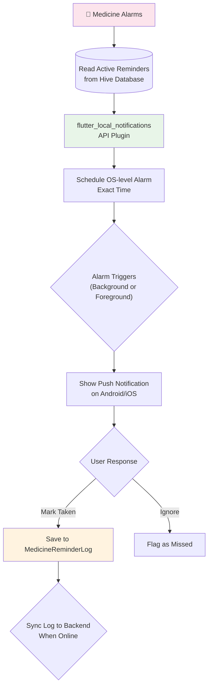

```mermaid
flowchart TB
    Feature3["🔔 Medicine Alarms"] --> ReadHive[("Read Active Reminders<br>from Hive Database")]
    ReadHive --> OS_Plugin["flutter_local_notifications<br>API Plugin"]
    OS_Plugin --> Sched["Schedule OS-level Alarm<br>Exact Time"]
    Sched --> Trigger{"Alarm Triggers<br>(Background or Foreground)"}
    Trigger --> NotifyUI["Show Push Notification<br>on Android/iOS"]
    NotifyUI --> UserAction{"User Response"}
    UserAction -- Mark Taken --> LogAction["Save to MedicineReminderLog"]
    UserAction -- Ignore --> Missed["Flag as Missed"]
    LogAction --> SyncLog{"Sync Log to Backend<br>When Online"}

    style Feature3 fill:#fce4ec
    style OS_Plugin fill:#e8f5e8
    style LogAction fill:#fff3e0
```
