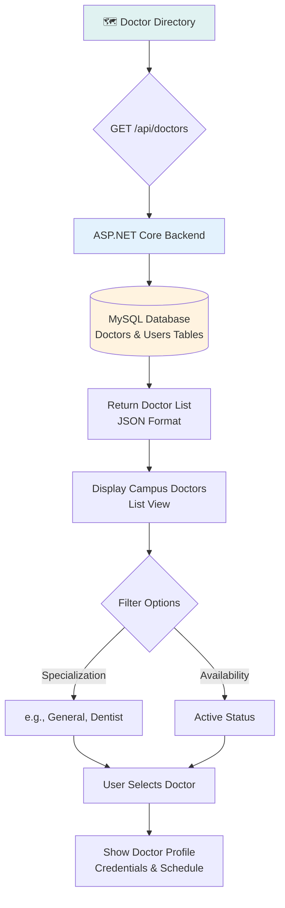

```mermaid
flowchart TB
    Feature4["🗺️ Doctor Directory"] --> API_Call{"GET /api/doctors"}
    API_Call --> ASP_NET["ASP.NET Core Backend"]
    ASP_NET --> MySQL[("MySQL Database<br>Doctors & Users Tables")]
    MySQL --> ReturnList["Return Doctor List<br>JSON Format"]
    ReturnList --> FlutterList["Display Campus Doctors<br>List View"]
    FlutterList --> Filter{"Filter Options"}
    Filter -- Specialization --> FilterSpecial["e.g., General, Dentist"]
    Filter -- Availability --> FilterAvail["Active Status"]
    FilterSpecial --> SelectDoc["User Selects Doctor"]
    FilterAvail --> SelectDoc
    SelectDoc --> DocProfile["Show Doctor Profile<br>Credentials & Schedule"]

    style Feature4 fill:#e0f2f1
    style ASP_NET fill:#e3f2fd
    style MySQL fill:#fff3e0
```
