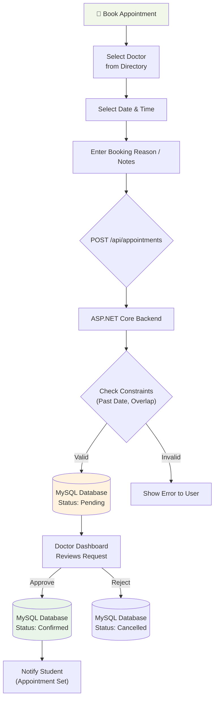

```mermaid
flowchart TB
    Feature5["📅 Book Appointment"] --> SelectDoc["Select Doctor<br>from Directory"]
    SelectDoc --> ChooseTime["Select Date & Time"]
    ChooseTime --> InputReason["Enter Booking Reason / Notes"]
    InputReason --> API_Call{"POST /api/appointments"}
    API_Call --> ASP_NET["ASP.NET Core Backend"]
    ASP_NET --> Validate{"Check Constraints<br>(Past Date, Overlap)"}
    Validate -- Valid --> SaveDB[("MySQL Database<br>Status: Pending")]
    Validate -- Invalid --> ErrorUI["Show Error to User"]
    SaveDB --> DoctorReview["Doctor Dashboard<br>Reviews Request"]
    DoctorReview -- Approve --> ConfirmDB[("MySQL Database<br>Status: Confirmed")]
    DoctorReview -- Reject --> CancelDB[("MySQL Database<br>Status: Cancelled")]
    ConfirmDB --> NotifyStudent["Notify Student<br>(Appointment Set)"]

    style Feature5 fill:#f1f8e9
    style SaveDB fill:#fff3e0
    style ConfirmDB fill:#e8f5e8
```
