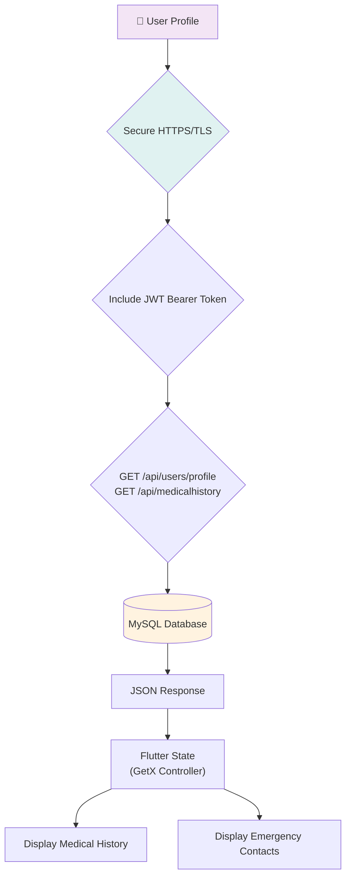

```mermaid
flowchart TB
    Profile["👤 User Profile"] --> HTTPS{"Secure HTTPS/TLS"}
    HTTPS --> Bearer{"Include JWT Bearer Token"}
    Bearer --> BackendAPI{"GET /api/users/profile<br>GET /api/medicalhistory"}
    BackendAPI --> MySQL[("MySQL Database")]
    MySQL --> ReturnData["JSON Response"]
    ReturnData --> ParseFlutter["Flutter State<br>(GetX Controller)"]
    ParseFlutter --> UI_Medical["Display Medical History"]
    ParseFlutter --> UI_Emergency["Display Emergency Contacts"]
    
    style Profile fill:#f3e5f5
    style HTTPS fill:#e0f2f1
    style MySQL fill:#fff3e0
```
